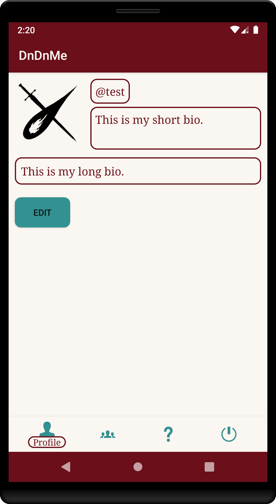
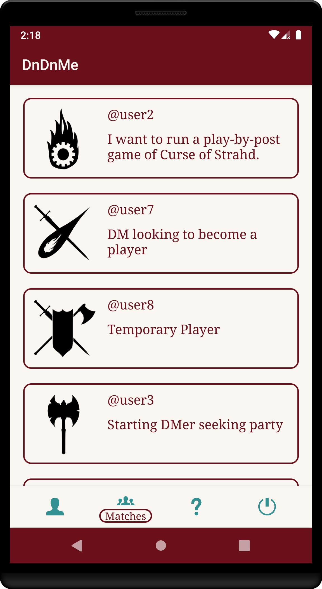
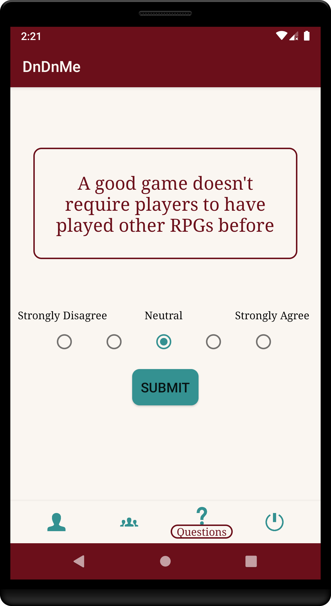
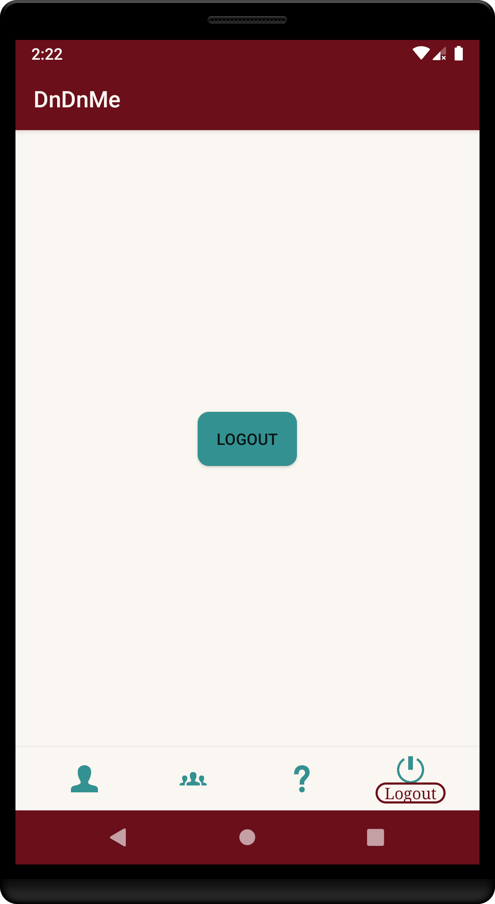
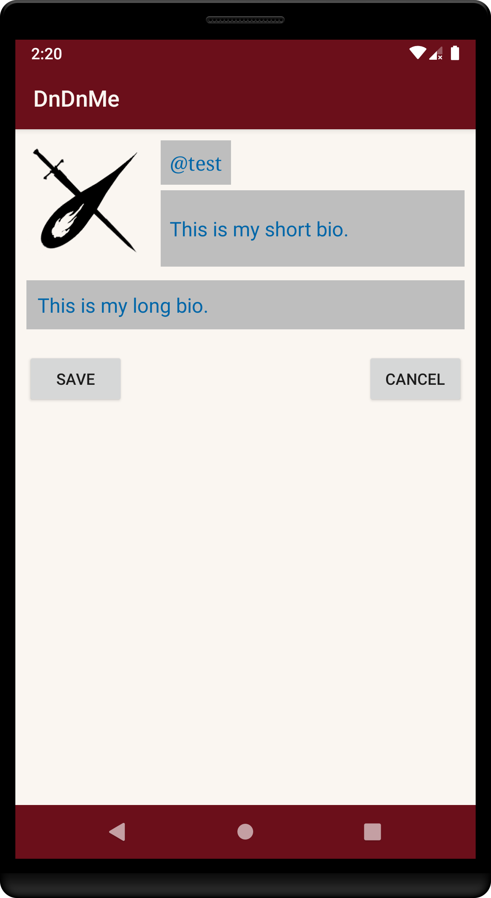
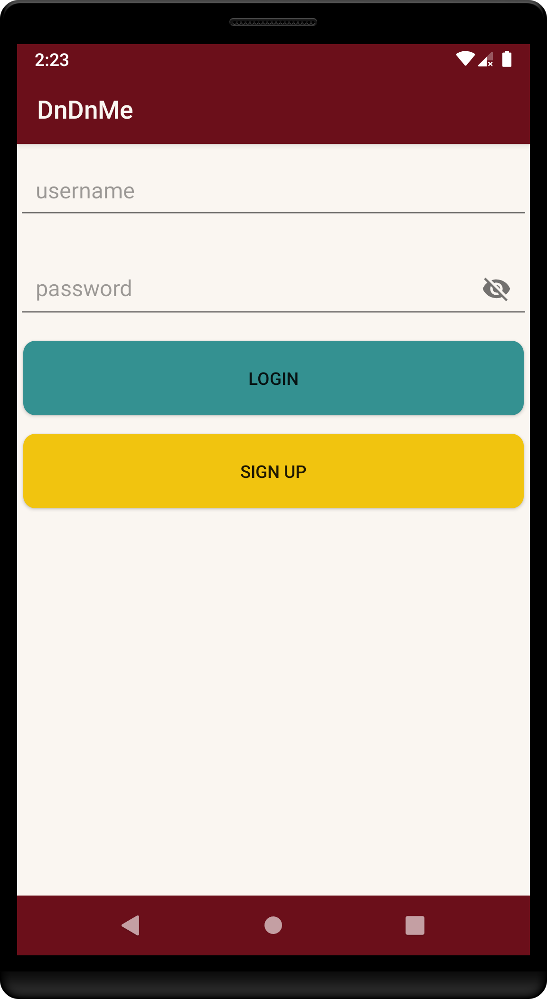
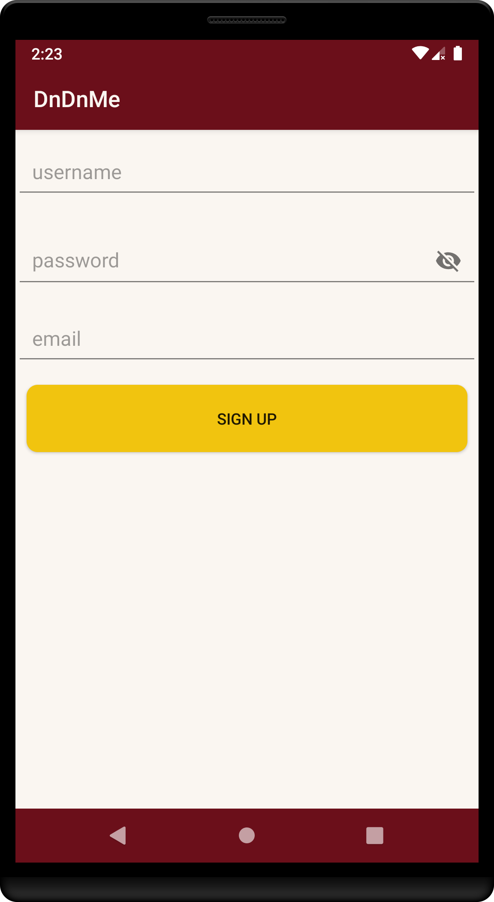

# D&D&Me

A native Android mobile application that allows users to find people to play Dungeons&Dragons (or other similar tabletop games) with. This app is meant to ease the difficulty of finding a group, for both players and DMs; it will take a player’s preferences of playstyle and match them with like-minded players with similar playstyles. The app will identify these player preferences through a questionnaire featured within the app, then provide matches to other users registered in the app's database.

Currently the app only performs with a database filled with dummy users, though all the information that a real user would
provide is attached to these dummy users. It utilizes the Parse Server, built off of MongoDB, as a database. [Parse](https://github.com/parse-community/parse-server) is an open source backend service.

## User Interface

Profile                       |  Matches                                  |  Questionnaire                       |  Logout
:----------------------------:|:-----------------------------------------:|:------------------------------------:|:---------------------------:
  |    |    | 

Edit Profile                                |  Login                                     |  Sign Up
:------------------------------------------:|:------------------------------------------:|:-------------------------:
  |    |  

## Usage

User must either login or sign up to use the rest of the app. Once the user is verified, they are taken to their Profile screen. On user signup, the user profile image is blank and their short and long bio sections are filled with default text. The user may click the Edit button to reach the Edit Profile screen, where they can change their profile image, short bio, and long bio. The short bio is displayed to other users on the Matches screen, while the long bio is displayed to other users when they click through to reach the full Profile screen.

The user will only view valid matches on the Matches screen when they have completed the questionnaire on the Questionnaire screen. The questionnaire is 28 questions long, and can be retaken as many times as the user likes. The Logout screen will immediately log the user out when they click the Logout button. The user remains logged in to the app, even across app restarts, unless they manually log out.

For best experience: rather than sign up, users may use the following username and password to login to the app and view the various functions

**Username: test**

**Password: test**

#### Known Issues
* After saving a new profile image on the Edit Profile screen and returning to the Profile screen, the profile image is not displayed

## Authors

* **Janeth Delgado**
